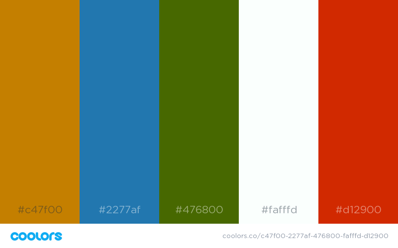

# Hololight VS Code Theme

Hololight is an all-light UI Theme. 

For the code elements, it uses deep primary colors on a light background:

I also like the Iosevka customizable programming font: [Iosevka](https://github.com/be5invis/Iosevka)
